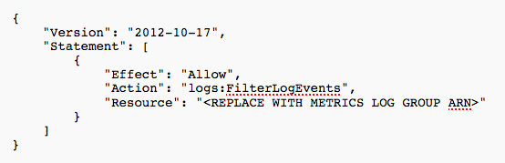
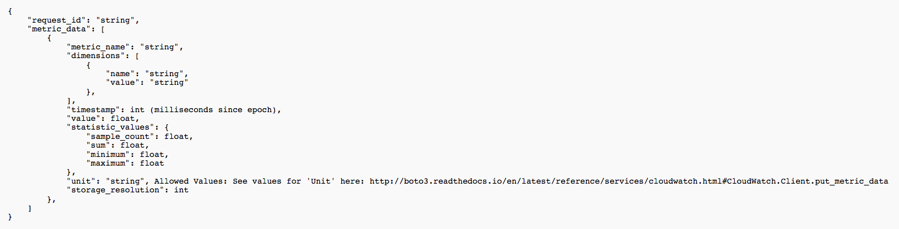

# AWS Serverless Metrics Publisher

### A metric publisher to batch and publish metrics to CloudWatch.

## A Brief Explanation

The Metric Publisher Application accepts metrics as input in JSON format,
logs those metrics, and periodically gathers all new data from the Log Group,
batches the new metrics together, and publishes them to CloudWatch. For more
details, see "How to Deploy and Use" below.

## How to deploy and Use

### Initial Deployment

To deploy the application, first fill in the sections under "Configure
application parameters." The Application name can be left as it is:
metric-publisher-app. The BatchingFrequencyInMinutes parameter is set at
5 minutes by default, but can be modified to be as low as 1 minute, or as many
as 60 minutes. This is the frequency that new metrics will be batched together
and published to CloudWatch. The Namespace parameter also has a default value,
but should be changed to something that better reflects the usage.

Next, click "Deploy".

Once the app has successfully deployed, click on "View CloudFormation stack" in
the upper right hand corner.

Under "Resources", click on the link under "Physical ID" corresponding to
the "MetricPublisherRole" resource. Click the blue button labeled
"Attach policies".

Due to current incompatibility with the Serverless Application Model (SAM), the
permission to filter log events from a log group is currently not available upon
deployment. However, this permission can be added in easily via one of the
following two methods:

#### 1)

In the search bar, search for "CloudWatchLogsReadOnlyAccess". Click the
checkbox next to the entry that results from the search, then click
"Attach Policy" at the bottom of the screen.

#### 2)

Click "Create Policy" just above the search bar. Click the "JSON" tab,
and copy and paste the following in the text box, replacing what may already
be there:

The Metrics Log Group Arn can be found in the CloudFormation console in the
outputs section, under "Value".

Click "Review policy" at the bottom of the screen.

In the "Name" section, put "FilterLogEventsPolicy", or some other meaningful
name. Fill in an optional description.

Click "Create policy".

Your lambda function should now have the necessary permission to access the
Metrics Log Group resource in your app.

### How to use the app

The main entry point for the app is the Metric Logger Lambda function.
This function can be invoked through the AWS CLI, or through the AWS
Lambda console. The input is metrics in JSON format, with the following
fields:

Wait the number of minutes specified in the "BatchingFrequencyInMinutes" parameter,
or invoke the Metric Publisher Lambda Function manually. There is no input.

Your metrics can now be seen in the CloudWatch console under the "metrics" tab.

## License Summary

This sample code is made available under a modified MIT license.
See the LICENSE file.
